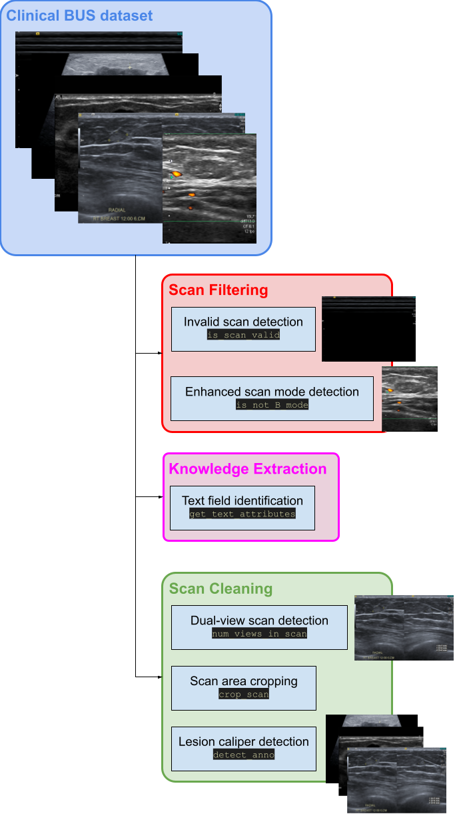

# BUSClean
---
## BUSClean: Open-source software for breast ultrasound image pre-processing and knowledge extraction for medical AI
###### Github repository containing all relevant code for submission
This repository is designed to provide an open-source solution for cropping BUS images for injestion into deep learning pipelines, flagging scans with abnormalities not consistently indicated in BUS DICOM metadata, and extracting knowledge about scan position and purpose from burnt-in scan annotations. 

### Pipeline Overview:


### Results
Performance on the internal test set for identifying each type of scan abnormality is described below. Scan shape cropping or lesion caliper location determination are not included in performance measurements due to poor definition of "best" cropping.
|                           | Sensitivity | Specificity |
|---------------------------|-------------|-------------|
| Laterality (text)         | 99.2%       | 98.2%       |
| Orientation (text)        | 97.6%       | 100%        |
| Distance (text)           | 96.7%       | 98.7%       |
| Position (text)           | 100%        | 100%        |
| Axilla (text)             | 95.8%       | 100%        |
| Lesion measurement (text) | 97.5%       | 98.3%       |
| Procedural imaging (text) | 100%        | 100%        |
| Enhanced scan mode        | 100%        | 99.5%       |
| Invalid scan              | 100%        | 100%        |
| Dual-view scan            | 100%        | 98.6%       |
| Lesion caliper presence   | 96.7%       | 93.3%       |

## Installation and system requirements
- Tested on Ubuntu 20.04.6 LTS
- Python version: 3.9.16
- To install dependencies, run:
```python3
python setup.py install
```
## Demo
- Demo scripts are provided in the outermost folder.
- A demo dataset is provided purely to validate code functionality, the dataset is not representative of the complete dataset used to develop or evaluate pipeline performance in the manuscript. 
- To validate code functionality, run sample code in notebook corresponding to desired functionality (e.g. for illustrative examples of flagging and cropping procedures)
    - `SampleArtifacts.ipynb` for sample notebook showing identification of invalid and B-mode scans, as well as caliper (lesion annotation) detection.  
    - `SampleCropping.ipynb` for sample notebook showing cropping of scans to the scan area (removing background) and to remove calipers (UNTESTED).
    - `SampleTextDetection.ipynb` for sample notebook showing identification, standardization, and classification of burnt-in sonographer text annotations. 
